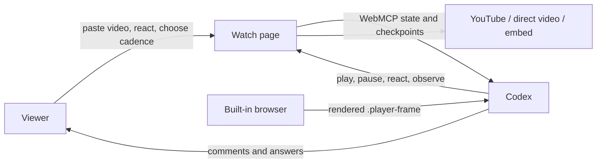

# Architecture

Watch with Codex is a single-page, event-driven watch-along. The architecture keeps the video page small and treats the existing Codex conversation as the assistant's memory, language interface, and reasoning context.

## System boundary



There are three distinct responsibilities:

1. **The page owns live session state.** It owns the selected source, player state, media-time cursor, pending signals, cadence, and visible reactions.
2. **WebMCP exposes structured actions.** It transfers playback state, exact timing, viewer signals, and explicit capability failures.
3. **Codex interprets the moment.** The model combines the visible frame, signal, previous conversation, and current user request. The page does not map emojis to canned text.

## Runtime components

| Component | Responsibility |
| --- | --- |
| `app/page.tsx` | URL parsing, player surfaces, local session state, reaction UI, media-time observer, and WebMCP tool registration. |
| `app/api/youtube-metadata/route.ts` | Validates a YouTube video ID and resolves title and author through YouTube oEmbed. |
| `app/globals.css` | Dark player-first interface, responsive layout, reaction picker, and reaction animation. |
| `app/layout.tsx` | Site metadata and root document shell. |
| `vite.config.ts` | Vinext, OpenAI Sites, and Cloudflare-compatible build integration. |
| `.openai/hosting.json` | OpenAI Sites project binding. It contains no runtime secret. |

The application has no database and no independent chat backend. Session state lives in the open page and resets when the viewer changes the video or closes the page.

## Session lifecycle

1. The viewer submits a video URL.
2. The page classifies it as YouTube, direct video, or generic embed.
3. A new media session ID and compact metadata record are created.
4. The appropriate player surface reports normalized playback state.
5. The page registers the five WebMCP tools against `navigator.modelContext`.
6. Codex calls `watch_get_session` once, then starts each `watch_observe_next_moment` inside a programmatic browser call that also captures `.player-frame`.
7. Scheduled checkpoints and viewer reactions repeatedly wake the observer; the same browser program captures the frame in its next operation and returns the checkpoint and image together before Codex reasons.
8. Changing the video clears the cursor, queued signals, metadata, and reactions before a new session begins.

## Player abstraction

All media surfaces normalize their state into the same public shape:

- source URL and source kind;
- `idle`, `loading`, `ready`, `playing`, `paused`, `ended`, or `unavailable` status;
- current time and duration when exposed;
- playback rate;
- whether play, pause, and timing are controllable.

YouTube uses the IFrame Player API. Direct files use an HTML video element. Generic embeds are intentionally fail-closed: the iframe stays visible, but the tool returns an explicit unsupported-state error when the host page cannot read timing or control playback.

## Observation loop

`watch_observe_next_moment` is a long-poll over a persistent media-time cursor.

### Scheduled checkpoint

When the video is playing, the observer stores the previous playback position and the next checkpoint. A 5-second cadence means five seconds of video, so changing playback speed does not distort the observation spacing.

When the model spends time reasoning, the next call does not restart a fresh five-second timer. The cursor remains anchored to the prior schedule. The result reports:

- previous and current playback times;
- formatted timecodes;
- elapsed media time;
- crossed and missed checkpoint counts;
- the next checkpoint;
- whether a seek or discontinuity was detected.

A seek resets the schedule at the new playback position instead of pretending all skipped moments were observed.

### Viewer signal

Clicking an emoji creates a structured signal with its creation time, playback time, and timecode. If an observation is pending, the signal resolves it immediately. Otherwise it is placed in a bounded queue for the next call.

The signal contract has four invariants:

1. every emoji is intentional input and must be acknowledged in context;
2. an emoji is never an implicit pause or stop request;
3. handling the signal does not end the watch loop;
4. while playback remains active, Codex repeats the paired observe-and-capture browser program in the same turn.

Viewer input is rate-limited to one reaction every three seconds. This prevents repeated clicks from flooding the signal queue without adding a semantic fallback.

## Frame capture boundary

The page cannot reliably serialize the pixels of a cross-origin YouTube iframe into a WebMCP JSON response. It therefore does not claim to send image bytes through the tool.

Instead, each successful observation participates in a paired visual-capture contract:

- capture source: browser page observation;
- target: `.player-frame`;
- included surfaces: video, captions, and player overlays;
- orchestration: preselect the target, await the observer, then capture in the same programmatic browser call;
- timing: the capture is the next browser operation after resolution, with zero intervening model turns;
- result: the structured observation and image are returned to Codex together.

This produces a clear boundary:

```text
one browser program {
  await WebMCP checkpoint
  -> immediate .player-frame capture
  -> return checkpoint + image together
}
-> model reasoning -> optional action -> next paired operation
```

The checkpoint anchors the frame to the reaction or scheduled media time. Browser capture provides the rendered pixels the viewer actually sees, including cross-origin content.

## Tool contracts

### `watch_get_session`

Returns stable media identity, normalized playback state, available reactions, selected cadence, rate limits, and the viewing protocol. Stable title and author metadata are sent once instead of being repeated on every observation.

### `watch_observe_next_moment`

Requires active playback and exposed timing. It rejects concurrent observer calls, waits for either a media-time checkpoint or viewer signal, advances the cursor, and returns the frame-capture and continuation instructions.

### `watch_play` and `watch_pause`

Delegate to the active player controller. They explicitly fail when a generic embed does not expose playback controls.

### `watch_react`

Accepts one to five declared emojis and publishes them together at the current playback time. The page validates the count and supported emoji set before changing the interface.

## Context and metadata

Context is split by lifetime:

- **Session-level:** media session ID, source ID, provider, title, author, publication date, view count, and metadata status.
- **Observation-level:** wake reason, optional viewer signal, timing, cursor state, playback state, and visual-capture contract.
- **Conversation-level:** viewing preferences, previous explanations, language, and what the viewer wants from the video. This remains in Codex rather than being copied into the page.

YouTube title and author currently come from oEmbed. Publication date and view count remain nullable because they require a separate authenticated metadata provider. Direct media uses the filename when no richer identity exists.

## Reactions

The viewer has five immediate reactions and fifteen additional reactions behind the expanded picker. Codex can send one to five reactions in a single call.

Reactions are deliberately symmetric but not deterministic. The same `❓` may request historical context, clarification of a chart, or an explanation of a joke depending on the visible frame and conversation. Semantic interpretation belongs to the model; deterministic code is limited to validation, timing, rate limits, and rendering.

## Failure model

The site fails explicitly instead of fabricating support. Representative errors include:

- no video selected;
- playback not active;
- player timing unavailable;
- another observation already pending;
- player controls unavailable;
- unsupported reaction or invalid reaction count.

Observation stops when playback pauses, ends, becomes unavailable, or the viewer asks Codex to stop watching.

## Deployment

The project uses Vinext to build the Next.js application through Vite, then targets the Cloudflare-compatible OpenAI Sites runtime. There are no D1 or R2 bindings in the MVP. The only server route is the cached YouTube metadata adapter.

## Extension points

### Transcript providers

A transcript provider can load timestamped cues once and return only the cues overlapping the previous and current checkpoints. Suitable implementations include page-owned text tracks, uploaded VTT/SRT files, authorized caption APIs, and user-authorized transcription. Generic cross-origin caption DOM is not treated as a reliable source.

### Voice questions

An in-player microphone can record one bounded utterance, pass it to an explicit speech-to-text adapter, and emit the resulting text as another viewer signal. The pending observer would wake immediately, preserving the same event channel and conversation instead of creating a second chat system.

### Metadata providers

Provider adapters can add publication date, view count, and richer source identity. Observations should continue referencing stable session IDs rather than repeating metadata on every checkpoint.

## Privacy and security

- The page stores no account credentials or conversation history.
- Environment files and private keys are excluded by `.gitignore`.
- YouTube IDs are validated before the server requests oEmbed metadata.
- Generic embeds receive no invented timing or control capability.
- Viewer reactions are bounded and rate-limited.
- The open page and browser security model remain the authority for what can be rendered or controlled.
