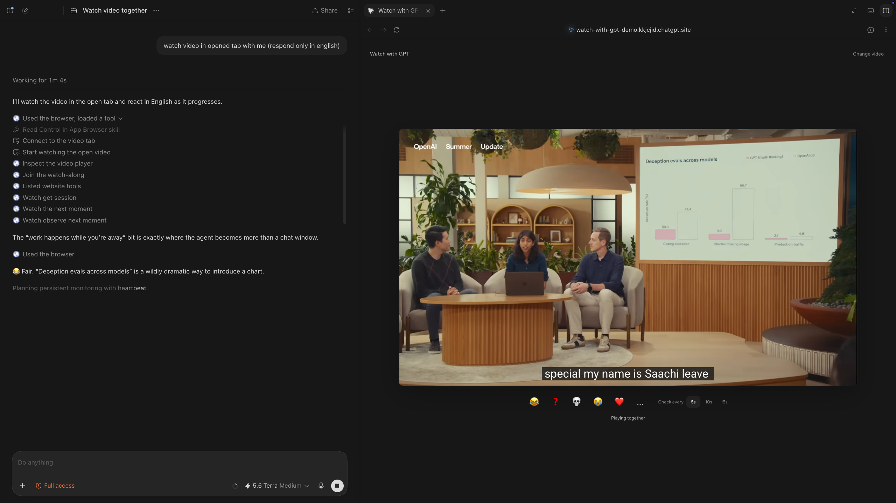
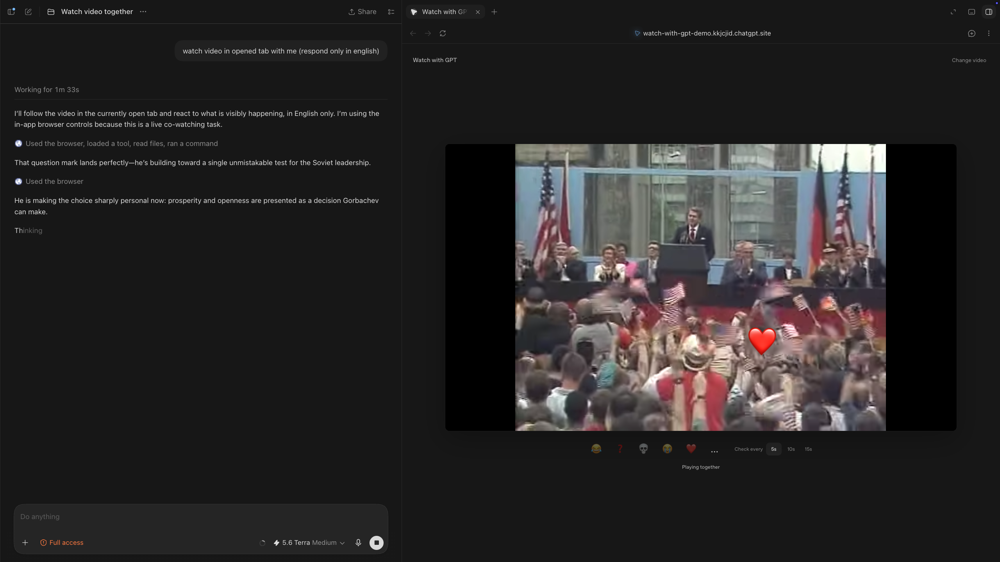

# Watch with Codex

> [!WARNING]
> **Hackathon prototype.** This repository was built specifically for the OpenAI WebMCP Challenge. It is an intentionally scoped experiment—not a production product and not a representative sample of the scale or maturity of my other projects.

[](https://webmcp.devpost.com/)


[](LICENSE)

Watch videos with Codex as a live companion in the same browser and the same conversation.




[Live demo](https://watch-with-gpt.feodijnikita.chatgpt.site/) · [Architecture](ARCHITECTURE.md)

## What it is

Watch with Codex is an event-driven WebMCP watch-along. A person opens a video in the site, asks Codex to watch with them, and both participate in the same live playback session.

The project is deliberately not a summarizer and does not create a second AI chat inside the player. The existing Codex conversation remains the memory and conversation surface. The page contributes the current video, playback state, timing, viewer signals, and a small set of actions.

While the video plays, Codex can:

- observe the current moment every 5, 10, or 15 seconds of media time;
- receive a viewer reaction immediately instead of waiting for the next checkpoint;
- use the visible frame and conversation context to interpret that reaction;
- answer in the existing conversation without ending the watch-along;
- publish one to five lightweight reactions over the player;
- pause or resume supported players when the user asks.

Viewer reactions are intentional input, not canned commands. `😂`, `❓`, `❤️`, or any other available emoji carries the current playback time, but its meaning is decided from the frame and conversation. A reaction interrupts the pending observation; it does not implicitly pause or stop the video.

## Why WebMCP

Ordinary chat can discuss a video link, but it does not share the page's live state. WebMCP lets the open site expose actions directly to Codex in the same browser session.

The page registers five site tools:

| Tool | Purpose |
| --- | --- |
| `watch_get_session` | Reads the selected media, player state, cadence, and viewing protocol once at the start. |
| `watch_observe_next_moment` | Waits for the next media-time checkpoint or returns immediately when the viewer reacts. |
| `watch_play` | Starts or resumes a supported player. |
| `watch_pause` | Pauses a supported player. |
| `watch_react` | Publishes a burst of one to five reactions at the current moment. |

`watch_observe_next_moment` is both a clock and an event channel. It follows video playback time rather than wall-clock time, preserves a cursor between calls, detects seeks, and reports missed checkpoints when model reasoning takes longer than the selected cadence.

The tool result provides the exact checkpoint and names `.player-frame` as the visual target. The browser agent then captures the rendered player immediately before reasoning. This boundary matters: WebMCP provides structured page state, while browser observation supplies the pixels of cross-origin players such as YouTube.

See [ARCHITECTURE.md](ARCHITECTURE.md) for the complete data flow and design decisions.

## Run locally

Requirements:

- Node.js 22.13 or newer;
- the current ChatGPT desktop app with the built-in browser;
- a model with [site-tools support](https://learn.chatgpt.com/docs/webmcp). At the time of this MVP, use GPT-5.6 Sol or Terra; Luna has WebMCP disabled.

```bash
npm install
npm run dev
```

Open the local URL printed by the development server in ChatGPT's built-in browser. Paste a YouTube URL, direct browser-playable video URL, or embeddable player URL, then ask:

> Watch this with me using the site's tools. Stay mostly quiet and keep watching until I stop you.

For a production build:

```bash
npm run build
npm run start
```

## Media support

- **YouTube:** playback state and controls use the YouTube IFrame Player API; title and author come from YouTube oEmbed.
- **Direct video files:** use the browser's native video element and expose timing and controls directly.
- **Generic embeds:** remain visible, but cross-origin restrictions may prevent timing or playback control. Tools fail explicitly when a capability is unavailable.

The MVP does not claim structured subtitle extraction. Captions visible inside the player can appear in the browser capture, but reliable transcript windows require a separate transcript provider. The same architecture can later support page-owned text tracks, authorized caption APIs, uploaded VTT/SRT files, or user-authorized transcription.

## Stack

- React and Next.js
- Vinext and Vite
- OpenAI Sites
- WebMCP site tools
- YouTube IFrame Player API and oEmbed

## License

[MIT](LICENSE)
